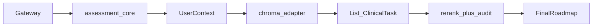

# Architecture overview

## Repository layout (high level)

```
Upheal-RAG-System/
├── docs/                 # This documentation (canonical)
├── services/             # Microservices-style Python packages (in-process gateway)
├── src/                  # Legacy monolith pieces (api, rag, clinical_forms, integration)
├── data/                 # Vector DB, chunks, books (not all tracked in git)
├── tests/                # Pytest suite for services
├── deployments/          # Docker scaffolding
├── requirements.txt      # Root Python deps (gateway + RAG + tests)
└── README.md             # Project intro + link to docs/
```

## Request flow (microservices gateway)



Code entry: [`services/gateway/main.py`](../../services/gateway/main.py).

## Technology stack

- **API:** FastAPI, Pydantic v2
- **Embeddings / RAG:** SentenceTransformers (`all-mpnet-base-v2`), ChromaDB
- **Assessment:** Bayesian updates in [`src/api/assessment_engine.py`](../../src/api/assessment_engine.py), blended in [`services/assessment/core.py`](../../services/assessment/core.py)

## Data

- **Chunks:** e.g. `data/rag_chunks/semantic_chunks.json`
- **Vector stores:** `data/vector_db_mini` (legacy), `data/vector_db_mini_enriched` (optional; see ingestion docs)
